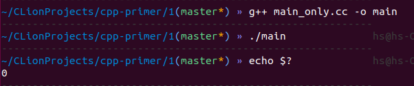
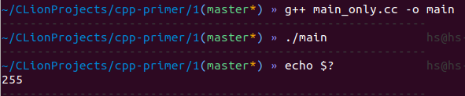
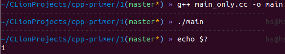

# 查看`main`函数的返回值

在大多数系统中，`main`函数的返回值是一个状态指示器。返回值为0意味着成功，非0返回值的意义由系统定义，通常一个非0返回值指示了发生错误的种类。`main`函数返回值的获取方式是由系统决定的，在UNIX系统中，通过以下指令可获取main函数的返回值。

```shell
echo $?
```

## 编写代码进行测试

这是一个最简单的C++程序，直接返回0。

```c++ main_only.cc
int main()
{
    return 0;
}
```

在终端编译运行，并查看返回值。



可见`echo $?`正确地输出了`main`函数的返回值。

## 将返回值修改为-1

```c++ main_only.cc
int main()
{
    return -1;
}
```

重新编译运行：



这次`echo $?`没有正确地输出-1，而是输出了255，推测原因是存储该值的变量是一个8位无符号整数。

## 将返回值修改为257

```c++ main_only.cc
int main()
{
    return 257;
}
```

若存储程序返回状态的变量是8位无符号整数，那么该程序运行后，`echo $?`将输出1，验证这一想法：



# `std::cout`缓冲

C++中的IO操作通常将数据先存储在缓冲区。输出缓冲可以被显式地冲洗，以将缓冲区中的数据写入文件。

*C++ Primer*第一章提到了3种会冲洗`std::cout`缓冲的情况：

- 使用`std::endl`操作符(manipulator)
- 读取`std::cin`
- 程序结束时，自动冲洗

