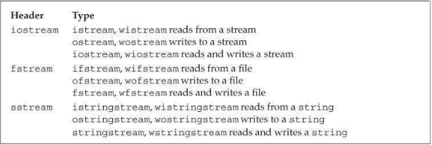
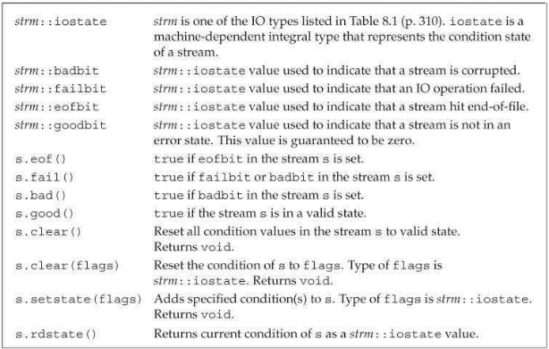
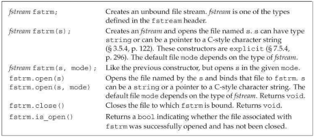

# IO类

- IO库类型和头文件


## IO对象无拷贝或赋值

- 由于不能拷贝IO对象，我们不能将函数的形参或返回类型设为流类型。

## 条件状态

- IO库条件状态


## 管理输出缓冲

- 导致缓冲刷新的条件有以下几种：
  - 程序正常结束
  - 缓冲区满
  - 使用`endl`, `flush`等操纵符显式刷新缓冲
  - 使用`unitbuf`操纵符设置流的内部状态，使流在每次输出操作后自动刷新缓冲
  - 一个输出流A可以关联到另一个流B，此时读写B时，A的缓冲区会被刷新
- 有两个与`endl`类似的操纵符：`flush`和`ends`。`flush`刷新缓冲区但不向输出添加任何字符；`ends`在缓冲区末尾插入一个空字符，然后刷新缓冲区。
```c++
cout << "hi!" << endl;   // writes hi and a newline, then flushes the buffer
cout << "hi!" << flush;  // writes hi, then flushes the buffer; adds no data
cout << "hi!" << ends;   // writes hi and a null, then flushes the buffer
```

# 文件输入和输出

- `fstream`特有操作


## 使用文件流对象

- 当`fstream`对象被销毁时，会自动调用`close`。

## 文件模式

- 文件模式


- 默认情况下，当我们打开一个`ofstream`时，文件的内容会被丢弃。阻止一个`ofsteam`清空给定文件内容的方法是同时指定`app`模式：
```c++
// file1 is truncated in each of these cases
ofstream out("file1");   // out and trunc are implicit
ofstream out2("file1", ofstream::out);   // trunc is implicit
ofstream out3("file1", ofstream::out | ofstream::trunc);
// to preserve the file's contents, we must explicitly specify app mode
ofstream app("file2", ofstream::app);   // out is implicit
ofstream app2("file2", ofstream::out | ofstream::app);
```

# string流

- stringstream特有操作


