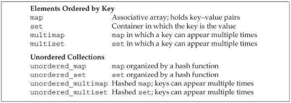
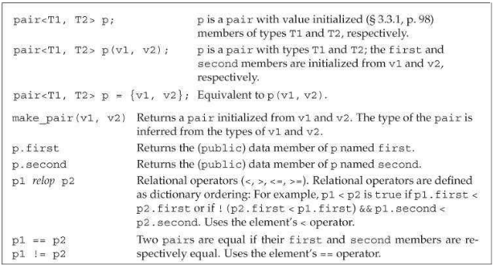
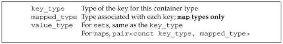
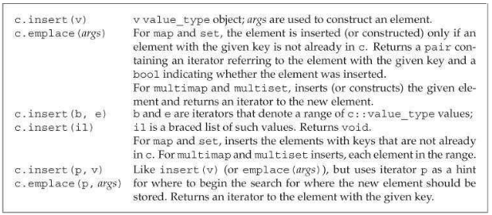
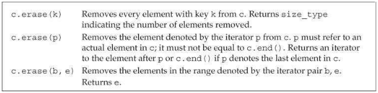
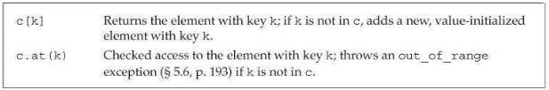
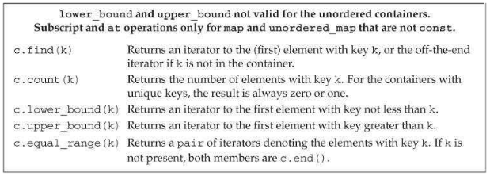
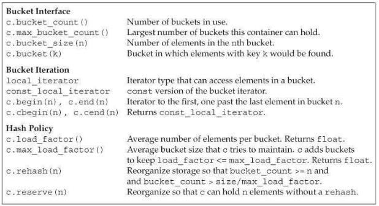

# 关联容器

- 关联容器类型
  

# 使用关联容器

- 使用关联数组的一个典型例子是单词数统计：
```c++
// count the number of times each word occurs in the input
map<string, size_t> word_count; // empty map from string to size_t
string word;
while (cin >> word)
        ++word_count[word];   // fetch and increment the counter for word
for (const auto &w : word_count) // for each element in the map
    // print the results
    cout <<  w.first << " occurs " << w.second
         << ((w.second > 1) ? " times" : " time") << endl;
```

- 若`word`不存在于`map`中，下标操作会创建一个键为`word`值为`0`的元素。

- 当我们从`map`中获取一个元素时，得到的元素类型为`pair`。

# 关联容器概述

## 定义关联容器

- 在`C++ 11`标准下，关联容器可以进行列表初始化：

```c++
map<string, size_t> word_count;  // empty
// list initialization
set<string> exclude = {"the", "but", "and", "or", "an", "a",
                       "The", "But", "And", "Or", "An",
"A"};
// three elements; authors maps last name to first
map<string, string> authors = { {"Joyce", "James"},
                                {"Austen", "Jane"},
                                {"Dickens", "Charles"} };
```

- `map`或`set`中的键必须是唯一的，一个键只能对应容器中的一个元素；`multimap`和`multiset`没有这个限制，可以有多个元素具有相同的键。

## 键类型的要求

- 默认情况下，标准库使用键类型的`<`运算符来比较两个键。

- 对于没有`<`运算符的类型，可以在模板参数中提供比较操作类型（函数指针）：
```c++
bool compareIsbn(const Sales_data &lhs, const Sales_data &rhs)
{
    return lhs.isbn() < rhs.isbn();
}
multiset<Sales_data, decltype(compareIsbn)*> bookstore(compareIsbn);
```

- 对函数名使用`decltype`时，必须添加`*`才能得到函数指针类型。

##  `pair`类型

- `pair`的默认构造函数对数据成员进行值初始化。
- `pair`上的操作


# 关联容器操作

- 关联容器的额外类型别名


## 关联容器迭代器

- `set`类型定义了`iterator`和`const_iterator`类型，但两种迭代器对`set`的元素都只能进行只读访问。

## 添加元素

- 关联容器`insert`操作


## 删除元素

- 从关联容器中删除元素


## `map`的下标操作

- `map`和`unordered_map`的下标操作


## 访问元素

- 在一个关联容器中查找元素的操作


# 无序容器

- 无序容器管理操作


