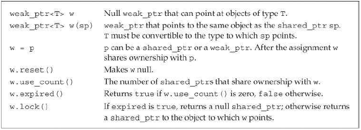

# 动态内存

- 静态内存用于保存局部`static`对象、类的`static`成员以及定义在任何函数之外的变量。栈内存用于保存定义在函数内的非`static`变量。
- 除了静态内存与栈内存，每个程序还拥有一个内存池，这部分内存被称为**自由空间**（free store）或**堆**（heap）。

## 动态内存与智能指针

- 在C++中，动态内存的管理通过 一对运算符完成：`new`，在动态内存中为对象分配空间并返回一个指向该对象的指针，我们可以选择对对象进行初始化；`delete`，接受一个动态对象的指针，销毁该对象，并释放与之关联的内存。
- 新标准库提供了两种**智能指针**（smart pointer）类型来管理动态对象：`shared_ptr`允许多个指针指向同一个对象；`unique_ptr`则“独占”所指向的对象。标准库还定义了一个名为`weak_ptr`的伴随类，它是一种弱引用，指向`shared_ptr`所管理的对象。

### `shared_ptr`类

- 默认初始化的智能指针保存着一个空指针。

- `shared_ptr`和`unique_ptr`都支持的操作


- `shared_ptr`独有的操作


- 一旦一个`shared_ptr`的计数器变为0，它将自动释放自己所管理的对象：
```c++
auto r = make_shared<int>(42); // int to which r points has one user
r = q; // assign to r, making it point to a different address
       // increase the use count for the object to which q points
       // reduce the use count of the object to which r had pointed
       // the object r had pointed to has no users; that object is automatically freed
```

### 直接管理内存

- 运算符`new`分配内存，`delete`释放`new`分配的内存。
- 默认情况下，动态分配的对象是默认初始化的：
```c++
string *ps = new string; // initialized to empty string
int *pi = new int; // pi points to an uninitialized int
```

- 可以使用直接初始化的方式初始化一个动态分配的对象，可以使用传统的构造方式，也可以使用列表初始化：
```c++
int *pi = new int(1024); // object to which pi points has value 1024
string *ps = new string(10, '9'); // *ps is "9999999999"
// vector with ten elements with values from 0 to 9
vector<int> *pv = new vector<int>{0,1,2,3,4,5,6,7,8,9};
```

- 由于编译器使用初始值类型来推断需要分配内存的类型，只有当括号中仅有单一初始化器时才可以使用`auto`：
```c++
auto p1 = new auto(obj); // p points to an object of the type of obj
// that object is initialized from obj
auto p2 = new auto{a,b,c}; // error: must use parentheses for the initializer
```

- 类似其他`const`对象，动态分配的`const`对象必须进行初始化。
- 若`new`不能分配所要求的内存空间，它会抛出一个类型为`bad_alloc`的异常，可以改变`new`的使用方式阻止其抛出异常：
```c++
// if allocation fails, new returns a null pointer
int *p1 = new int; // if allocation fails, new throws std::bad_alloc
int *p2 = new (nothrow) int; // if allocation fails, new returns a null pointer
```

### `shared_ptr`和`new`结合使用

- 定义和改变`shared_ptr`的其他方法


- 接受指针参数的智能指针构造函数是`explicit`的：
```c++
shared_ptr<int> p1 = new int(1024); // error: must use direct initialization
shared_ptr<int> p2(new int(1024)); // ok: uses direct initialization
```

- 默认情况下，智能指针使用`delete`释放与之关联的对象。
- 当将一个`shared_ptr`绑定到一个普通指针时，我们就将内存的管理责任交给了这个`shared_ptr`。一旦这样做了，我们就不应该再使用内置指针来访问`shared_ptr`所指向的内存了。
- 虽然编译器不会给出报错信息，但将另一个智能指针也绑定到`get`返回的指针上是错误的。

### 智能指针与异常

- 如果一个异常发生在`new`与`delete`之间，并且异常没有在`f`中捕获，那么内存将永远不会被释放：
```c++
void f()
{
    int *ip = new int(42); // dynamically allocate a new object
    // code that throws an exception that is not caught inside f
    delete ip; // free the memory before exiting
}
```

### `unique_ptr`

- 不同于`shared_ptr`，同时只能有一个`unique_ptr`指向一个给定对象。
- `unique_ptr`操作


- 与`shared_ptr`不同，没有类似`make_shared`的标准库函数返回一个`unique_ptr`。当我们定义一个`unique_ptr`时，需要将其绑定到一个`new`返回的指针上。类似`shared_ptr`，初始化`unique_ptr`必须采用直接初始化形式：
```c++
unique_ptr<double> p1; // unique_ptr that can point at a double
unique_ptr<int> p2(new int(42)); // p2 points to int with value 42
```

- 不能拷贝`unique_ptr`的规则有一个例外：我们拷贝或赋值一个将要被销毁的`unique_ptr`，最常见的例子是从函数返回一个`unique_ptr`：
```c++
unique_ptr<int> clone(int p) {
    // ok: explicitly create a unique_ptr<int> from int*
    return unique_ptr<int>(new int(p));
}

unique_ptr<int> clone(int p) {
    unique_ptr<int> ret(new int (p));
    // . . .
    return ret;
}
```

### `weak_ptr`

- 

## 动态数组

- 分配了动态数组的类必须定义自己版本的操作，在拷贝、复制及销毁对象时管理所关联的内存。

### `new`和数组

- 使用`new`分配一个数组时，获得的不是数组类型的对象，而是指向数组元素类型的指针。由于得到的不是数组类型，不能对动态数组调用`begin`或`end`。
- 默认情况下，`new`分配的对象，不管是单个分配还是数组中的，都是默认初始化的。可以对数组中的元素进行值初始化，方法是在大小之后跟一队空括号。在新标准中，还可以提供一个元素初始化器的花括号列表：
```c++
int *pia = new int[10]; // block of ten uninitialized ints
int *pia2 = new int[10](); // block of ten ints value initialized to 0
string *psa = new string[10]; // block of ten empty strings
string *psa2 = new string[10](); // block of ten empty strings

// block of ten ints each initialized from the corresponding initializer
int *pia3 = new int[10]{0,1,2,3,4,5,6,7,8,9};
// block of ten strings; the first four are initialized from the given initializers
// remaining elements are value initialized
string *psa3 = new string[10]{"a", "an", "the", string(3,'x')};
```

- 为了释放动态数组，必须使用一种特殊形式的`delete`，在指针前加上一个空方括号对：
```c++
delete p; // p must point to a dynamically allocated object or be null
delete [] pa; // pa must point to a dynamically allocated array or be null
```

- 数组中的元素按逆序销毁。
- 指向数组的`unique_ptr`


- 与`unique_ptr`不同，`shared_ptr`不支持直接管理动态数组，如果希望使用`shared_ptr`管理一个动态数组，必须提供自己定义的删除器：
```c++
// to use a shared_ptr we must supply a deleter
shared_ptr<int> sp(new int[10], [](int *p) { delete[] p; });
sp.reset(); // uses the lambda we supplied that uses delete[] to free the array
```

### `allocator`类

- 不能分配元素类型为“没有默认构造函数的类类型”的动态数组。
- 标准库`allocator`类及其算法


- `allocator`算法


