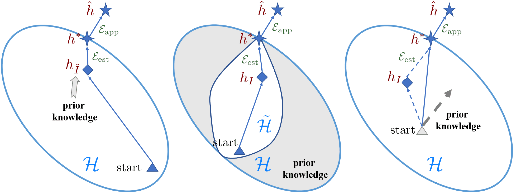
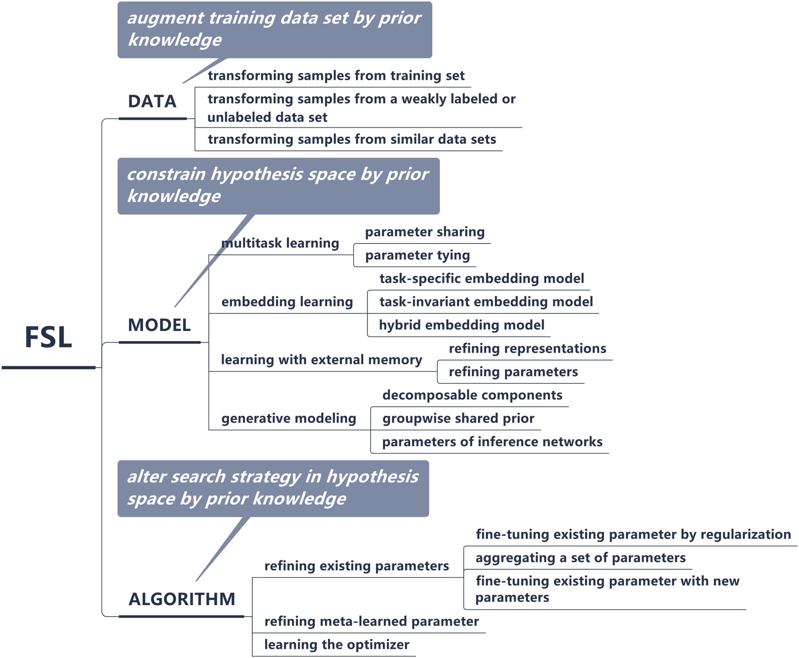

Few-shot的一篇survey，翻译一下**2.4 Taxonomy**，这一节总结了当前FSL的几类方法。

<!--more-->

为了缓解FSL在监督学习中的经验误差最小化器（empirical risk minimizer）$h_I$不可靠的问题，必须使用先验知识。根据先验知识对哪方面进行了增强，已有的FSL工作可分为以下几类 (Figure 2):

Fig. 2. Different perspectives on how FSL methods solve the few-shot problem.

- 数据。这类方法使用先验知识对$D_{train}$进行增强将样本的数量从$I$提升到$\tilde{I}$，其中$\tilde{I}\gg{I}$。将标准的机器学习模型与算法应用于增强的数据，便可获得更准确的经验误差最小化器$h_I$(Figure 2(a))。
- 模型。这类方法使用先验知识限制$\mathcal{H}$的复杂度，得到一个小得多的假设空间$\tilde{\mathcal{H}}$如Fig.2(b)所示，灰色区域是根据先验知识确定的，不包含最优$h^*$的区域。在更小的$\tilde{\mathcal{H}}$中，$D_{train}$足够学习到可靠的$h_I$。
- 算法。这类方法使用先验知识搜索$\theta$，其中$\theta$将$\mathcal{H}$中的最优假设$h^*$参数化。先验知识通过提供较好的初始化(Figure 2(c)中的灰色三角形)，或指导搜索步骤(Figure 2(c)中的灰色虚线)以改变搜索策略。对于后一种方式，最终的搜索步骤同时受到先验知识和经验风险最小化器(empirical risk minimizer)的影响。

相应地，现有的工作可按该分类法进行分类，如Fig.3所示

Fig. 3. A taxonomy of FSL methods based on the focus of each method.

