# 顺序容器概述

- 顺序容器类型
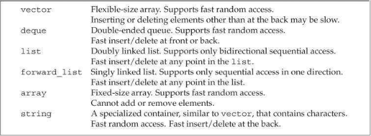

- 与`vector`、`deque`和`array`相比，`list`和`forward_list`的内存开销更大。

# 容器库概览

- 容器操作
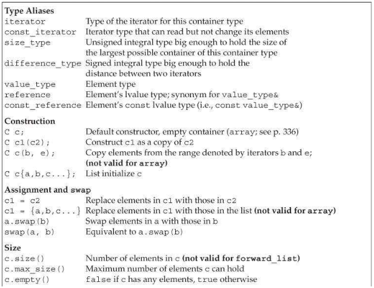
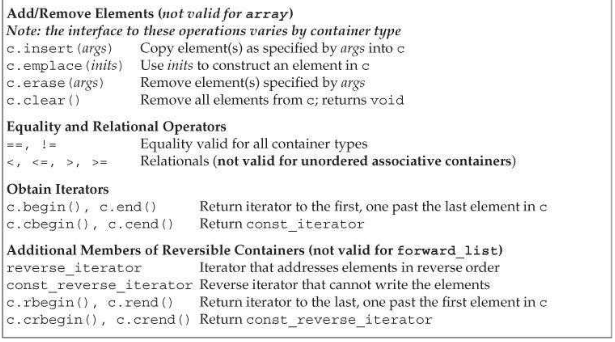

- 容器定义和初始化
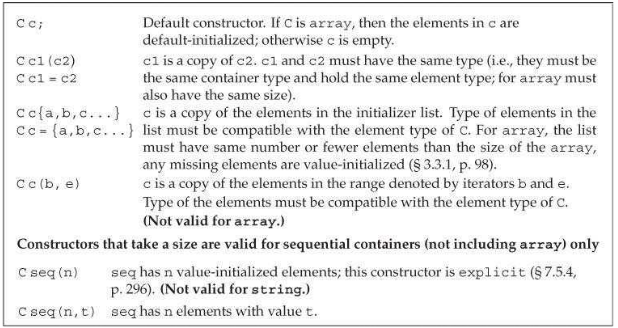

- 为了创建一个容器为另一个容器的拷贝，两个容器的类型及其元素类型必须匹配。不过，当传递迭代器参数来拷贝一个范围时，不要求容器类型是相同的。而且，新容器和原容器中的元素类型也可以不同，只要能将拷贝的元素转换为要初始化的元素类型即可。
```c++
// each container has three elements, initialized from the given initializers
list<string> authors = {"Milton", "Shakespeare", "Austen"};
vector<const char*> articles = {"a", "an", "the"};
list<string> list2(authors);     // ok: types match
deque<string> authList(authors); // error: container types don't match
vector<string> words(articles);  // error: element types must match
// ok: converts const char* elements to string
forward_list<string> words(articles.begin(), articles.end());
```

- 如果元素是内置类型或具有默认构造函数的类类型，可以只为构造函数提供一个容器大小参数。如果元素类型没有默认构造函数，则除了大小参数外，还必须指定一个显式的元素初始值。

- 与内置数组一样，标准库`array`的大小也是类型的一部分。

- 容器赋值运算
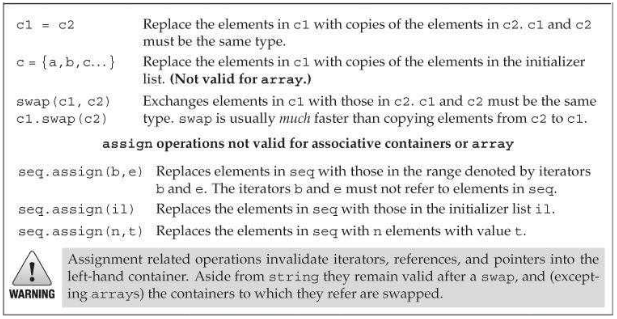

- 对于`array`，`swap`会真正的交换它们的元素，在`swap`操作后，指针、引用和迭代器所绑定的元素不变，但元素值已经与另一个array中对应元素的值进行了交换。

# 顺序容器操作

- 想顺序容器添加元素的操作
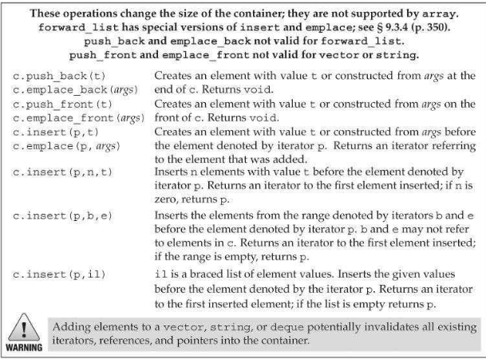

- 如果传递给`insert`一对迭代器，它们不能指向添加元素的目标容器。
- `emplace`函数在容器中直接构造元素。
- 在顺序容器中访问元素的操作
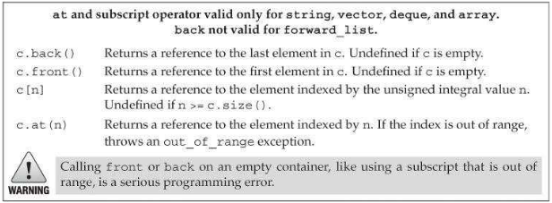

- 顺序表容器的删除操作
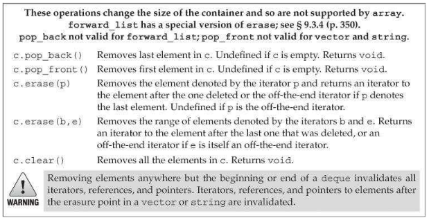

- 在`forward_list`中插入或删除元素的操作
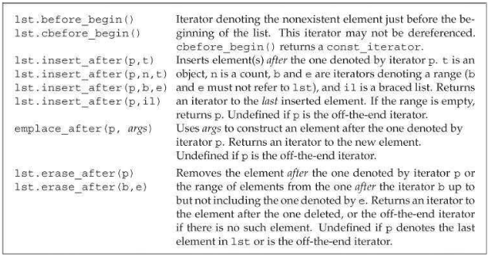

- 顺序容器大小操作
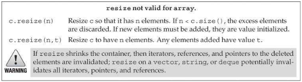

# `vector`对象是如何增长的

- 容器大小管理操作
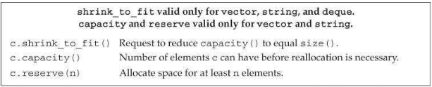

- 若请求的容器大小小于或等于已有的容量，`reserve`不会进行任何操作。
- 调用`shrink_to_fit`并不保证一定退回内存空间。

# string的额外操作

- 构造`string`的其他方法
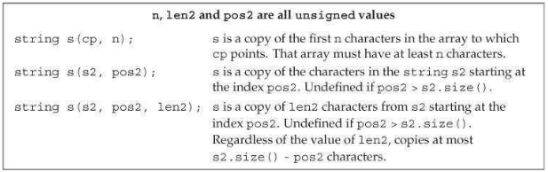

- `substr`操作
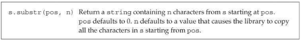
如果`pos + n`大于`string`的大小，则`substr`只拷贝到`string`的末尾。

- 修改`string`的操作
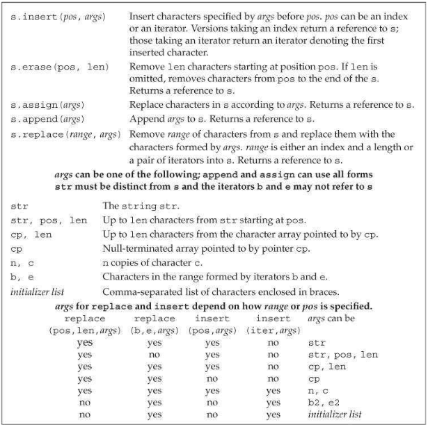

- `string`搜索操作
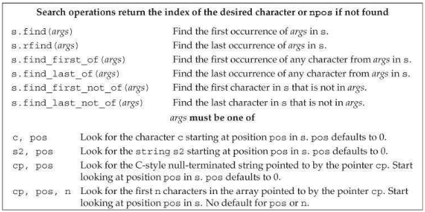

- `s.compare`的几种参数形式
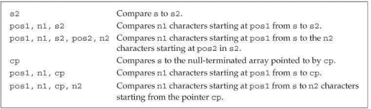

- `string`与数值之间的转换
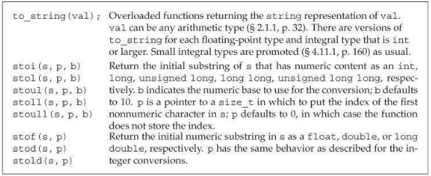

# 容器适配器

- 所有容器适配器都支持的操作和类型
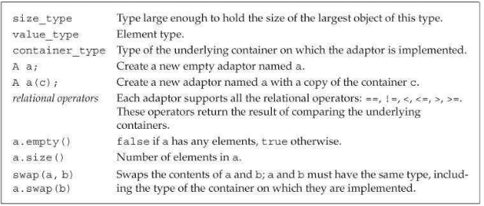

- 默认情况下，`stack`和`queue`基于`deque`实现，`priority_queue`基于`vector`实现。可以在创建一个适配器时将一个命名的顺序容器作为第二个类型参数，重载默认容器类型。
```c++
// empty stack implemented on top of vector
stack<string, vector<string>> str_stk;
// str_stk2 is implemented on top of vector and initially holds a copy of svec
stack<string, vector<string>> str_stk2(svec);
```

- `stack`的特有操作
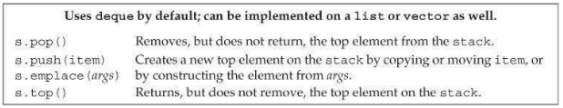

- `queue`和`priority_queue`的特有操作
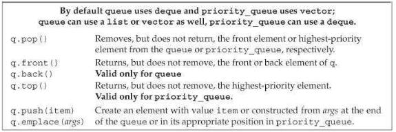

