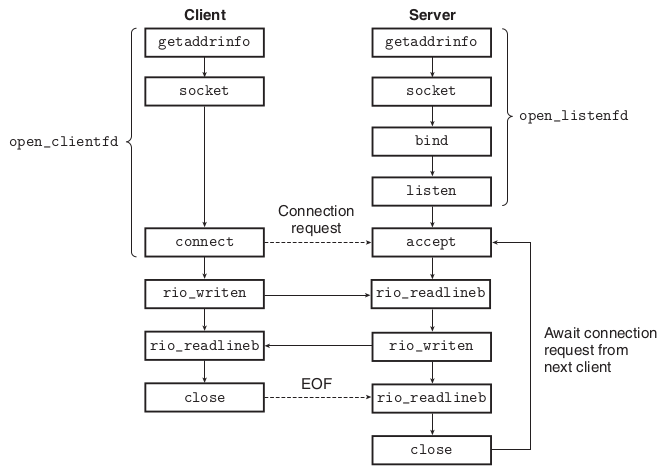
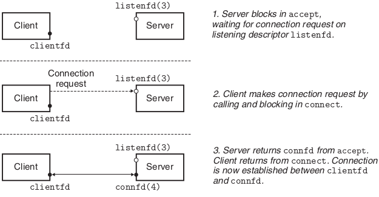
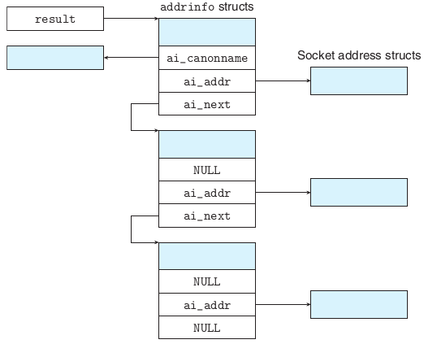

内容来自(摘抄自）CS: APP 11.4 The Sockets Interface.

<!--more-->

# 套接字接口

套接字接口是Unix系统用于构建网络应用程序的一套函数，通常与I/O函数结合使用。图1是在一个*客户端-服务器*交互过程中套接字接口使用的示意图。


<center>图1 基于套接字的网络应用概览</center>

## 套接字地址结构

从Unix内核的角度来看，一个套接字就是通信的一个端点；从Unix程序的角度来看，套接字是一个具有相应文件描述符的已打开文件。

因特网的套接字地址存储在类型为`sockaddr_in`的16字节结构中。对于因特网应用，`sin_family`成员是`AF_INET`，`sin_port`成员是一个16位的端口号，`sin_addr`是32位IP地址。IP地址和端口号总是以网络字节序（大端法）存放的。

```c
/* IP socket address structure */
struct sockaddr_in {
    uint16_t sin_family;       /* Protocol family (always AF_INET) */
    uint16_t sin_port;         /* Port number in network byte order */
    struct in_addr sin_addr;   /* IP address in network byte order */
    unsigned char sin_zero[8]; /* Pad to sizeof(struct sockaddr) */
};

/* Generic socket address structure (for connect, bind, and accept) */
struct sockaddr {
    uint16_t sa_family; /* Protocol family */
    char sa_data[14];   /* Address data */
};
```

`connect`、`bind`和`accept`函数需要一个指向与协议相关的套接字地址结构的指针，早期的C语言不存在`void *`指针，套接字函数要求一个指向通用`sockaddr`结构的指针作为参数，应用程序需要将“与协议特定的结构的指针”强制转换成`sockaddr *`指针。

## `socket`函数

客户端和服务器使用`socket`函数创建一个**套接字描述符**(*socket descriptor*)。

```c
#include <sys/types.h>
#include <sys/socket.h>
int socket(int domain, int type, int protocol);
// Returns: nonnegative descriptor if OK, −1 on error
```

`socket`返回的描述符仅是部分打开的，还不能用于读写。`socket`函数需要的参数通常由`getaddrinfo`自动生成。完成打开套接字的工作需要用到`connect`、`bind`和`accept`等函数，取决于程序是客户端还是服务器。

## `connect`函数

客户端通过调用`connect`函数建立与服务器的连接。

```c
#include <sys/socket.h>
int connect(int clientfd, const struct sockaddr *addr, socklen_t addrlen);
// Returns: 0 if OK, −1 on error
```

`connect`函数尝试与套接字地址为`addr`的服务器建立因特网连接，其中`addrlen`是`sizeof(sockaddr_in)`。`connect`函数会阻塞直到成功建立连接或是发生错误。与`socket`相同，`connect`函数需要的参数通常由`getaddrinfo`自动生成。

## `bind`, `listen`, `accept`函数

服务器使用`bind`, `listen`, `accept`函数与客户端建立连接。

```c
#include <sys/socket.h>
int bind(int sockfd, const struct sockaddr *addr, socklen_t addrlen);
// Returns: 0 if OK, −1 on error
```

`bind`函数向内核请求将`addr`中的服务器地址关联到套接字描述符`sockfd`，参数`addrlen`是`sizeof(sockaddr_in)`。与`socket`和`connect`相同，`bind`函数需要的参数通常由`getaddrinfo`自动生成。

```c
#include <sys/socket.h>
int listen(int sockfd, int backlog);
// Returns: 0 if OK, −1 on error
```

客户端是是发起连接请求的主动实体，服务器是等待来自客户端请求的被动实体。默认情况下，内核把`socket`函数创建的描述符当作**主动套接字**(*active socket*)，它将被用于连接的客户端。服务器可以调用`listen`函数，将一个主动套接字转化为一个**监听套接字**(*listening socket*)。

服务器通过调用`accept`函数等待来自客户端的连接。

```c
#include <sys/socket.h>
int accept(int listenfd, struct sockaddr *addr, int *addrlen);
// Returns: nonnegative connected descriptor if OK, −1 on error
```

`accepet`函数等待来自客户端的连接请求到达监听关键字`listenfd`，然后将客户端的套接字地址填入`addr`，并返回一个**已连接描述符**(*connected descriptor*)，该描述符可以通过Unix I/O函数与客户端通信，图2描述了客户端与服务器连接的过程。


<center>图2 监听描述符与已连接描述符</center>

## `getaddrinfo`与`getnameinfo`

Linux提供了`getaddrinfo`与`getnameinfo`，可以使套接字地址结构与用字符串表示的主机名、主机地址、服务名和端口号之间相互转换。我们可以将这两个函数与套接字接口结合使用，编写与IP协议版本无关的网络应用程序。

`getaddrinfo`函数将字符串形式的主机名、主机地址、服务名和端口号转化为套接字地址结构。

```c
#include <sys/types.h>
#include <sys/socket.h>
#include <netdb.h>
int getaddrinfo(const char *host, const char *service,
                const struct addrinfo *hints,
                struct addrinfo **result);
// Returns: 0 if OK, nonzero error code on error

void freeaddrinfo(struct addrinfo *result);
// Returns: nothing

const char *gai_strerror(int errcode);
// Returns: error message

struct addrinfo {
    int ai_flags;              /* Hints argument flags */
    int ai_family;             /* First arg to socket function */
    int ai_socktype;           /* Second arg to socket function */
    int ai_protocol;           /* Third arg to socket function */
    char *ai_canonname;        /* Canonical hostname */
    size_t ai_addrlen;         /* Size of ai_addr struct */
    struct sockaddr *ai_addr;  /* Ptr to socket address structure */
    struct addrinfo *ai_next;  /* Ptr to next item in linked list */
};
```

`host`参数可以是域名或IP地址，`service`参数可以是服务名（http、ftp等）或端口号。可选的参数`hint`是一个`addrinfo`结构，用于控制`getaddrinfo`返回套接字地址的种类，比如可以设置`ai_family`为`AF_INET`限制只返回IPv4地址。`getaddrinfo`的结果存放在`result`中，`result`指向一个`addrinfo`的链表，链表中的每一项都指向一个套接字地址结构，如图3所示。



<center>图3 getaddrinfo返回的数据结构</center>
通常，客户端调用`getaddrinfo`，再遍历结果链表，对链表中每一个套接字地址依次调用`socket`与`connect`直到成功建立连接。

-------------------------

`getnameinfo`的功能与`getaddrinfo`相反，它将套接字地址结构转换为字符串形式的主机名与服务名。

```c
#include <sys/socket.h>
#include <netdb.h>
int getnameinfo(const struct sockaddr *sa, socklen_t salen,
                char *host, size_t hostlen,
                char *service, size_t servlen, int flags);
// Returns: 0 if OK, nonzero error code on error
```

以下为使用`getaddrinfo`与`getnameinfo`的一个示例：

```c
#include "csapp.h"

int main(int argc, char **argv)
{
    struct addrinfo *p, *listp, hints;
    char buf[MAXLINE];
    int rc, flags;

    if (argc != 2) {
	fprintf(stderr, "usage: %s <domain name>\n", argv[0]);
	exit(0);
    }

    /* Get a list of addrinfo records */
    memset(&hints, 0, sizeof(struct addrinfo));                         
    hints.ai_family = AF_INET;       /* IPv4 only */
    hints.ai_socktype = SOCK_STREAM; /* Connections only */
    if ((rc = getaddrinfo(argv[1], NULL, &hints, &listp)) != 0) {
        fprintf(stderr, "getaddrinfo error: %s\n", gai_strerror(rc));
        exit(1);
    }

    /* Walk the list and display each IP address */
    flags = NI_NUMERICHOST; /* Display address string instead of domain name */
    for (p = listp; p; p = p->ai_next) {
        Getnameinfo(p->ai_addr, p->ai_addrlen, buf, MAXLINE, NULL, 0, flags);
        printf("%s\n", buf);
    } 

    /* Clean up */
    Freeaddrinfo(listp);

    exit(0);
}
```

## 套接字接口的包装

```c
int open_clientfd(char *hostname, char *port) {
    int clientfd;
    struct addrinfo hints, *listp, *p;
    
    /* Get a list of potential server addresses */
    memset(&hints, 0, sizeof(struct addrinfo));
    hints.ai_socktype = SOCK_STREAM; /* Open a connection */
    hints.ai_flags = AI_NUMERICSERV; /* ... using a numeric port arg. */
    hints.ai_flags |= AI_ADDRCONFIG; /* Recommended for connections */
    Getaddrinfo(hostname, port, &hints, &listp);
    
    /* Walk the list for one that we can successfully connect to */
    for (p = listp; p; p = p->ai_next) {
        /* Create a socket descriptor */
        if ((clientfd = socket(p->ai_family, p->ai_socktype, p->ai_protocol)) < 0)
            continue; /* Socket failed, try the next */
        
        /* Connect to the server */
        if (connect(clientfd, p->ai_addr, p->ai_addrlen) != -1)
            break; /* Success */
        Close(clientfd); /* Connect failed, try another */
    }

    /* Clean up */
    Freeaddrinfo(listp);
    if (!p) /* All connects failed */
        return -1;
    else    /* The last connect succeeded */
        return clientfd;
}

int open_listenfd(char *port) 
{
    struct addrinfo hints, *listp, *p;
    int listenfd, rc, optval=1;

    /* Get a list of potential server addresses */
    memset(&hints, 0, sizeof(struct addrinfo));
    hints.ai_socktype = SOCK_STREAM;             /* Accept connections */
    hints.ai_flags = AI_PASSIVE | AI_ADDRCONFIG; /* ... on any IP address */
    hints.ai_flags |= AI_NUMERICSERV;            /* ... using port number */
    if ((rc = getaddrinfo(NULL, port, &hints, &listp)) != 0) {
        fprintf(stderr, "getaddrinfo failed (port %s): %s\n", port, gai_strerror(rc));
        return -2;
    }

    /* Walk the list for one that we can bind to */
    for (p = listp; p; p = p->ai_next) {
        /* Create a socket descriptor */
        if ((listenfd = socket(p->ai_family, p->ai_socktype, p->ai_protocol)) < 0) 
            continue;  /* Socket failed, try the next */

        /* Eliminates "Address already in use" error from bind */
        setsockopt(listenfd, SOL_SOCKET, SO_REUSEADDR,    //line:netp:csapp:setsockopt
                   (const void *)&optval , sizeof(int));

        /* Bind the descriptor to the address */
        if (bind(listenfd, p->ai_addr, p->ai_addrlen) == 0)
            break; /* Success */
        if (close(listenfd) < 0) { /* Bind failed, try the next */
            fprintf(stderr, "open_listenfd close failed: %s\n", strerror(errno));
            return -1;
        }
    }


    /* Clean up */
    freeaddrinfo(listp);
    if (!p) /* No address worked */
        return -1;

    /* Make it a listening socket ready to accept connection requests */
    if (listen(listenfd, LISTENQ) < 0) {
        close(listenfd);
	return -1;
    }
    return listenfd;
}
```