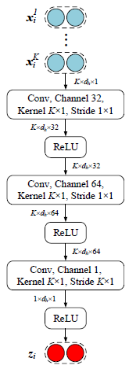

# 符号表

| 符号 | 含义 |
| --------- | --------------- |
| $x$       | 样本（句子）      |
| $\mathrm{x}$ |                 |
| $w_t$     | 句子中第t个单词 |
| $\mathrm{w}_t\in\mathbb{R}^{d_w}$ | 句子中第t个单词的词向量 |
| $\mathrm{p}_t\in\mathbb{R}^{2\times d_p}$ | 句子中第t个单词的相对两个实体的位置编码 |
| $d_w,d_p,d_c$ | 词向量维度，位置编码维度,CNN卷积核维度 |
| $\mathrm{e}_t$ | 句子中第t个单词的向量表示 |
| $\mathrm{W}\in\mathbb{R}^{T\times(d_w+2d_p)}$ | 长度为$T$的单个样本的向量表示 |
| $\mathrm{Q}\in\mathbb{R}^{T_q\times{d_c}}$ | 长度为$T_q$的查询集样本上下文向量表示 |
| $\mathrm{S}_k\in\mathbb{R}^{T_k\times{d_c}};k=1,...,K$ | 长度为$T_k$的支持集样本上下文向量表示 |

小写粗体字母为列向量 

# Instance Encoder 样本编码器

给定样本$x=\{w_1,...,w_T\}$，可以使用嵌入层（Embedding Layer）将每个单词$w_t$映射到连续输入嵌入（continuous input embeddings），使$\mathrm{w}_t\in\mathbb{R}^{d_w}$以表示单词的语义及句法含义。这些词嵌入由GloVe预训练。

对于每个单词$w_t$，将单词与实体的相对距离嵌入到两个$d_p$的向量并将其拼接得到位置嵌入$\mathrm{p}_t\in\mathbb{R}^{2\times d_p}$.

<!--more-->

最终的每个词的输入嵌入由其词嵌入与位置嵌入拼接而得。样本经过嵌入层处理，可得到以下形式的嵌入序列：

$\{\mathrm{e_1}...,\mathrm{e_n}\}=\{[\mathrm{w_1};\mathrm{p_1}],...,[\mathrm{w_n};\mathrm{p_n}]\},\mathrm{e_i}\in\mathbb{R}^{d_i},d_i=d_w+d_p\times2.$

编码层（Encoding Layer）使用CNN对输入嵌入（input embeddings）进行编码。对于卷积核窗口大小为$m$，维度为$d_h$的CNN，有：

$\mathrm{h_i}=CNN(\mathrm{e}_{i-\frac{m-1}{2}},...,\mathrm{e}_{i+\frac{m-1}{2}})$

对隐藏层嵌入进行最大池化操作，得到最终的样本嵌入$\mathrm{x}$：

$[\mathrm{W}]j=max\{[\mathrm{h_1}]_j,...,[\mathrm{h_n}]_j\}$

其中$[\cdot]_j$是向量的第$j$个值。

将以上的样本编码（instance encoding）操作定义为：

$\mathrm{W}=f_\phi(x)$

其中$\phi$是样本编码器的可学习参数。

# prototypical network 原型网络

原型网络的主要思想是使用一个称作原型的向量来表示每个关系。最简单的原型计算方法是分别对支持集中每种关系的所有样本嵌入取平均值：

$C^i=\frac{1}{K}\sum_{k=1}^{K}{\mathrm{S}_k^i},$

其中$C_i$是关系$r_i$的原型，$\mathrm{S}_k^i$是支持集$\mathcal{S}$中关系为$r_i$的一个样本的样本嵌入，$K$是支持集$S$中关系为$r_i$的样本数量。 

在简单原型网络中取平均值的方式下，所有的样本被视为具有相同的重要程度。可以使用**混合注意力机制**代替取平均值，为更重要的样本分配更高的权重。

对于一个查询集样本$q$，通过下式计算其属于$\mathcal{R}$中关系的概率：

$p_{\phi}(y=r_i|q)=\frac{exp(-d(f_{\phi}(q),C_i))}{\sum_{j=1}^{|\mathcal{R}|}exp(-d(f_{\phi}(q),C_j))},$

其中$d(\cdot,\cdot)$是用于计算两个向量间距离的度量函数。

# Attention

在Prototypical Network中，每个类别的原型由支持集中该类别所有样本的向量表示取均值而得。然而，在实际中每个类别的含义很丰富，在不同的样本中含义存在一定差别，直接对向量表示取平均值获得的原型不够准确。

注意力机制可以使模型更关注某些样本或样本的某些特征。

## Context attention

基于支持集中不同样本重要性不同的事实，提出上下文注意力机制，向与原型更相关的样本分配更高的权重。计算样本向量表示$\mathbf{S}$之间的矩阵乘积再除以$\sqrt{d_w}$以表示$\mathbf{S}$中样本之间的相关性，再对其使用$softmax$获得每个样本的权重。最终的$\mathbf{S}_{new}$由权重乘以样本向量表示获得：

$$\mathbf{S}_{new}=CATT(\mathbf{S})=softmax(\frac{ss^T}{\sqrt{d_w}})\mathbf{S}$$

## Hybrid Attention 

原文 *Hybrid Attention-Based Prototypical Networks for Noisy Few-Shot Relation Classification*

文中混合注意力包括两个模块：样本级别注意力模块从支持集中选择包含更多信息的样本；特征级别注意力模块在距离度量函数中强调更重要的维度。

### Instance-level Attention

原始的原型网络使用样本向量（vector of the instances）的平均值作为关系原型。在小样本的条件下，支持集样本数量有限，若一个关系中某个样本的向量表示（representation）与其他样本相差很大，则会使对应的原型产生很大偏差。同时，朴素的（vanilla）原型网络在从支持集提取特征时，从未见过具体的查询样本。因此，朴素（vanilla）的模型会提取到一些对识别查询集样本没有帮助的特征。

**这些现象**会导致模型在对查询集样本进行分类时计算出不准确的原型。为了改进原型网络，文中提出了样本级别注意力模块，使模型更关注与查询集相关的样本并缓解噪声。文中提出对于给定的查询集样本，每个支持集样本的作用不是完全相同的，对样本向量表示赋予一个权重$\alpha_j$，则原型的计算方式改变为：

$C^i=\sum_{k=1}^K{\alpha_k\mathrm{S}_k^i}.$

其中$\alpha_k$计算方式如下：

$$\alpha_k=\frac{\mathrm{exp}(e_j)}{\sum_{k=1}^{K}\mathrm{exp}(e_k)}$$

$$e_j=\mathrm{sum}\{\sigma(g(\mathrm{S}_k^i){\odot}g(\mathrm{Q}))\}$$

其中$g(\cdot)$是线性层，$\odot$是逐元素相乘，$\sigma(\cdot)$是激活函数，$\mathrm{sum}\{\cdot\}$是对向量中所有元素取和，文中使用tanh作为$\sigma(\cdot)$以产生$[-1,1]$的结果。

通过样本级别的注意力，与查询集样本具有相似特征的样本会获得更高的权重，最终的原型也会与这些样本更接近。直觉上，属于同种关系的样本也会存在很大的不同，甚至某些样本存在标记错误。查询集样本可能只与支持集中部分样本接近。对不同样本赋予不同权重后，得到的原型相比于原始的向量平均值会更加“典型”。

### Feature-level Attention

*Prototypical networks for few-shot learning*提出距离度量函数的选择对原型网络的效果有很大影响。原始的原型网络选择简单的欧几里德距离作为距离度量函数。由于在支持集中只有少量样本，特征提取会受到数据稀疏的影响（data sparsity）。因此，特征空间中的某些维度在识别特定关系时，更具有决定性作用。文中提出了特征级别的注意力，能够缓解特征稀疏（feature sparsity）的问题，更好的测量空间距离。

特征级别注意力在测量空间距离时，会更注意具有更强决定性的维度，采用以下距离度量函数代替平凡的欧几里德距离，

$d(\mathrm{s_1, s_2})=\mathrm{z}_i\cdot(\mathrm{s_1-s_2})^2$

其中$\mathrm{z}_i$是由特征级别注意力提取器计算得到的对关系$r_i$的分数向量。特征级别注意力提取器的结构见下图（**注意padding和stride**）：

该提取器基于每个关系的句向量表示计算出特征每个维度的线性可分程度。特征的某个维度越有用，该维度的分数就越高。将注意力分数乘上平方差距离，改变后的距离度量函数将更适用与度量给定关系与支持集样本的距离。

## Local Matching and Aggregation

为了更好的获取$\mathrm{Q}$与$\{\mathrm{S}_k;k=1,...,\mathrm{K}\}$之间的匹配信息，首先将$K$个支持集样本的向量表示拼接为一个矩阵，如下：

$$\mathrm{C}=\textrm{concat}(\{\mathrm{S}_k\}_{k=1}^{K})$$

其中$\mathrm{C}\in\mathbb{R}^{T_s{\times}d_c},T_s=\sum_{k=1}^K{T_k}$，$\mathrm{Q}$与$\mathrm{C}$匹配后的向量表示$\widetilde{\mathrm{Q}}$与$\widetilde{\mathrm{C}}$计算方式如下：

$$\alpha_{mn}=\mathrm{q}_m^\top\mathrm{c}_n$$

$$\widetilde{\mathbf{q}}_m=\sum_{n=1}^{T_s}\frac{\mathrm{exp}(\alpha_{mn})}{\sum_{n'=1}^{T_s}\mathrm{exp}(\alpha_{mn'})}\mathbf{c}_n, m\in\{1,...,T_q\}$$

$$\widetilde{\mathbf{c}}_n=\sum_{m=1}^{T_q}\frac{\mathrm{exp}(\alpha_{mn})}{\sum_{m'=1}^{T_q}\mathrm{exp}(\alpha_{m'n})}\mathbf{q}_m, n\in\{1,...,T_s\}$$

然后，使用一个ReLU激活层将原始的向量表示与匹配后的向量表示进行融合：

$$\bar{\mathbf{Q}}=\mathrm{ReLU}([\mathbf{Q};\mathbf{\widetilde{Q}};|\mathbf{Q}-\mathbf{\widetilde{Q}}|;\mathbf{Q}\odot\mathbf{\widetilde{Q}}]\mathbf{W}_1),$$

$$\bar{\mathbf{C}}=\mathrm{ReLU}([\mathbf{C};\mathbf{\widetilde{C}};|\mathbf{C}-\mathbf{\widetilde{C}}|;\mathbf{C}\odot\mathbf{\widetilde{C}}]\mathbf{W}_1),$$

其中$\odot$是逐元素相乘，

$\mathbf{W}_1\in\mathbb{R}^{4{d_c}\times{d_h}}$是该层用于降维的线性映射的权重。$\bar{\mathbf{C}}$将与$K$个支持集样本对应的分为$K$个向量表示$\{\bar{\mathbf{S}}_k\}_{k=1}^{K}$，其中$\bar{\mathbf{S}}_k\in\mathbb{R}^{T_k\times{d_h}}$。所有的$\bar{\mathbf{S}}_k$与$\bar{\mathbf{Q}}$再输入到隐藏层单元数为$d_h$的单层双向LSTM中，拼接两个方向的输出得到最终的本地匹配结果为：$\hat{\mathbf{S}}_k\in\mathbb{R}^{T_k\times{2d_h}}$和$\hat{\mathbf{Q}}\in\mathbb{R}^{T_q\times{2d_h}}$。

本地聚合的目标是本地匹配的结果$\hat{\mathbf{S}}_k,\hat{\mathbf{Q}}$转换为单个向量。本文使用最大池化与平均池化，再将其结果拼接，得到单个向量$\hat{\mathbf{s}}_k$或$\hat{\mathbf{q}}$,计算过程如下：

$\hat{\mathbf{s}}_k=[\mathrm{max}(\hat{\mathbf{S}}_k);\mathrm{ave}(\hat{\mathbf{S}}_k)],\forall k\in\{1,...,K\},$

$\hat{\mathbf{q}}=[\mathrm{max}(\hat{\mathbf{Q}});\mathrm{ave}(\hat{\mathbf{Q}})]$

其中$\hat{\mathbf{s}}_k,\hat{\mathbf{q}}\in\mathbb{R}^{4d_h}$。

## Instance Matching and Aggregation

与经典的原型网络类似，本文的方法使用支持集某个类别所有样本的向量表示$\{\hat{\mathbf{s}}_k\}_{k=1}^{K}$计算该类别的原型$\hat{\mathbf{s}}$，使用注意力机制聚合样本级别特征表示，每个样本的权重由$\hat{\mathbf{s}}_k$与$\hat{\mathbf{q}}$的匹配分数导出，匹配函数如下：

$\beta_k=\mathbf{v}^{\top}(\mathrm{ReLU}(\mathbf{W}_2[\hat{\mathbf{s}}_k;\hat{\mathbf{q}}]))$

其中$\mathbf{W}_2\in\mathbb{R}^{d_h\times8d_h}$，$\mathbf{v}\in\mathbb{R}^{d_h}$，$\beta_k$代表查询集样本$q$与支持集样本$\mathbf{s}_k$的匹配程度。然后，所有的$\{\hat{\mathbf{s}}_k\}_{k=1}^K$被聚合为一个向量$\hat{\mathbf{s}}$:

$\hat{\mathbf{s}}=\sum_{k=1}^K\frac{\mathrm{exp}(\beta_k)}{\sum_{k'=1}^K\mathrm{exp}(\beta'_k)}\hat{\mathbf{s}}_k$

$\hat{\mathbf{s}}$就是类别的原型。

## Class Matching

类别的原型$\hat{\mathbf{s}}$以及查询集样本$\hat{\mathbf{q}}$确定之后，类别匹配函数$f(\{s_k\}_{k=1}^K,q)$定义如下：

$f(\{s_k\}_{k=1}^K,q)=\mathbf{v}^\top(\mathrm{ReLU}(\mathbf{W}_2)[\hat{\mathbf{s}};\hat{\mathbf{q}}])$

在本文的实验中，共享权重$\mathbf{W}_2$与$\mathbf{v}$取得了最好的效果。

## Joint Training with Inconsistency Measurement

若一个类别中的支持集样本向量表示相差过大，得到的原型将难以捕捉所有支持集样本的共同特征。本文计算所有支持集样本与其对应类别原型的不一致程度，并将其加入损失函数进行训练。

[用词] prototype, vector

